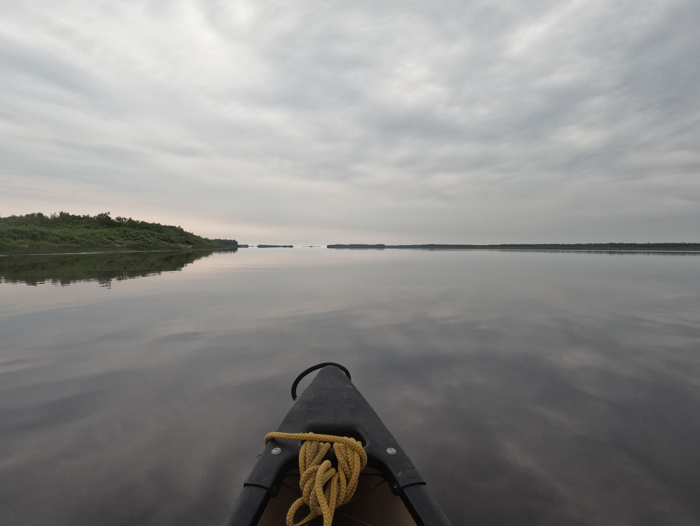

### Intro and Background

The Missinaibi River is a river in Northern Ontario that flows from Lake Missinaibi, just north of Chapleau, Ontario, through the town of Mattice, Ontario along the Highway 11 coridor, and finally meets the Matagami River forming the Moose River which flows into James Bay.

The river passes through the Canadian Shield and then drops of rapidly onto the James Bay lowlands before reaching the bay. The forests change from pine, to cedar and finally to low growth plants throughout the trip and the shores of the river change from rocky to pebbly beaches that line both sides of the river once the lowlands are entered.

There are a couple of famous sections along the river, including the cliff paintings on Lake Missinaibi and the magnificent Thunderhouse Falls a day or two past highway 11.

### Trip Report
#### Day 1 - Drive to Missinaibi


<span class="subtitle">Dog Lake Put-In</span>

```
Distance Traveled: 0km
Portages: None
Sets: None
Campsite: Dog Lake Campground - 16U 71790E 535515N
```

On June 29th, 2025, we woke up, ate a breakfast of pastries and loaded our gear onto the schoolbus for the long drive up to the town of Missanabie on Dog Lake in Northern Ontario. The bus departed at 9:10am, and after a quick stop at walmart to pick up some last minute items and to have a tent that we forgot dropped off, we proceeded on our way to the river. 

Along our drive we saw a moose at the side of the road, and found a pair of old boots in the forest while stopped for a bathroom break. We ate a lunch of sandwiches while on the bus.

We eventually reached the put-in on Dog Lake at 7:30pm, set up our tents by the boat launch and made burgers for dinner. We played some president in the tents before heading to sleep, ready for our first day of paddling in the morning.

#### Day 2 - First Day on the Water


<span class="subtitle">Crooked Lake</span>

```
Distance Traveled: 20km
Portages: 290m
Sets: None
Campsite: Old Bridge - 17U 28961E 535669N
```

In the morning, we quickly packed up our gear, had bagels for breakfast and immediately got on the water by 8:30am. We started by paddling Dog Lake, and luckily had tailwinds for the majority of the day. We even got to go tarp sailing while rafted together with the other boats.

After reaching the end of the lake, we had a short 290m portage, nicknamed the Height of Land, which was extremely muddy. We had a quick lunch of SB+J wraps and then got back on the water. Luckily, throughout the day the sun was in the process of drying up much of the rain from the previous night.

We got off the water at the midpoint of Crooked Lake at about 4:00pm, set up our tents and ate a dinner of mac n' cheese. 

#### Day 3 - Lake Missinaibi


<span class="subtitle">Tarp Sailing on Missinaibi Lake</span>

```
Distance Traveled: 16km
Portages: 385m
Sets: None
Campsite: Missinaibi Lake - 17U 30123E 536017N
```

We got on the water earlier, at around 8:20am, after a breakfast of scrambled bran, and paddled the rest of Crooked Lake. At the end of the lake we did a 385m portage over to the enormous Missinaibi Lake.

We visited the pictographs at Fairy Point, and continued tarp sailing down the lake with some lovely tailwinds. While at the pictographs, we met a trip from Camp Queen Elizabeth. We had tuna wraps for lunch.

We got off the water at 3:10pm, it rained a bit during campsite setup, but it was an otherwise sunny day. We made spaghetti and meat sauce for dinner and then went to bed.

#### Day 4 - Finishing the Lake


<span class="subtitle">Lunch on Missinaibi Lake</span>

```
Distance Traveled: 28km
Portages: None
Sets: None
Campsite: Quittagene Rapids - 17U 32160E 537460N
```

After a quick breakfast of apple crisp, we got on the water at a record 7:50am, ready to paddle the rest of the almost 30km down Missinaibi Lake. 

We started the day with strong tailwinds, but they shifted throughout the day into crosswinds creating waves that splashed into our boat. We stopped for lunch on a windswept rocky point and at some charcuterie, before powering out the rest of the lake.

We stopped for the night just before the first set of the river at about 3:30pm. We ate burrito bowls for dinner and were excited to start the whitewater of the trip in the morning!

#### Day 5 - The First Sets


<span class="subtitle">View from our Site at Peterbell Cliff</span>

```
Distance Traveled: 35km
Portages: None
Sets: 17
Campsite: Peterbell Cliff - 17U 32602E 538775N
```

Breakfast was peach crisp, and we quickly packed up and got on the water by 8:00am ready for the first whitewater of the trip!

We immediately scouted and ran Quittagene Rapids, the first set of the Missinaibi, and continued on more sets throughout the day including Long Rapids, Cedar Rapids, Sun Rapids and Barrel Rapids.

It was sunny, but there were some small headwinds throughout the day. I tipped on a small CI set after filling the boat to the gunnels with water from the waves. Going down first on my first day back on whitewater was not the right move. My drybag also ripped and I needed to patch it with some duct tape. We stopped for lunch to have some Hummus and Pitas.

We got off the water at 4:30 and made a delicious curry for dinner. Our campsite had a cliff overlooking the Peterbell marsh, and we went fishing and caught one, but it was too late to cook so we put it back and went to bed.

#### Day 6 - Things are Starting to Get Real

```
Distance Traveled: 23km
Portages: 1475m
Sets 8
Campsite: Greenhill Portage - 17U 31985E 539920N
```

We woke up to a wonderful sunny morning, and ate a breakfast of scrambled eggs and hashbrowns.  We got on the water a bit slower, at around 8:40am.

We ran a few sets throughout the day, including Swamp Rapids and Wavy Rapids, on which a boat flipped while ferrying in the waves, but it became more and more cloudy and rainy as we paddled. We had SB+J wraps again for lunch, notice how the menu is getting more and more repetitive.

To avoid Allan Falls, we decided to take an offchannel around an island, ending up having to climb over 2 log jams and do a short 75m portage over a third.

We reached Greenhill rapids at 4:00pm and decided it was much too late in the day to start a 1.4km section of CIII whitewater, so, to much dissapointment, we decided to take the portage instead. Having so much gear, we had to double or triple carry the whole portage, ending up walking over 5km each and finishing it at 6:00pm. We took a quick swim in the river at the end and then had chicken alfredo for dinner. 

#### Day 7 - Don't go Chasing Waterfalls


<span class="subtitle">Split Rock Falls</span>

```
Distance Traveled: 21km
Portages: 475m
Sets: 4
Campsite: Thunder Falls - 17U 32655E 541090N
```

It was cloudy and a bit rainy all day, and we got on the water at 8:30am after a breakfast of oatmeal.

We had 2 relatively short portages over some waterfalls, a 275m and 200m. We also ran a few sets including Calf Rapids and St. Peters Rapids. We had tuna wraps for lunch.

At one point the rain became so bad that we had to pull over to the side of the river and hide under some trees for a few minutes waiting for the rain to let up. We arrived at the campsite at 3:30pm and made chili for dinner before going to bed.

#### Day 8 - The People We Meet on the River

```
Distance Traveled: 39km
Portages: None
Sets: 3
Campsite: Before the Road to Mattice - 17U 33200E 543575N
```

We had a slow morning, with scrambled bran again for breakfast and a very late 8:50am put-in.

The day was long and mostly flatwater, however it was cloudy and a bit windy so it wasn't too hot. We passed a bridge where we met a group from Missinaibi Headwaters Outfitters, which included an old tripper from camp. We stopped for chicken wraps for lunch.

We got off the water at 4:30pm and made pasta aglio olio for dinner which was delicious.

#### Day 9 - Why are there So Many People on this River?


<span class="subtitle">Devil Rapids</span>

```
Distance Traveled: 49km
Portages: 240m
Sets: 9
Campsite: Albany Rock - 17U 32250E 547175N
```

It was back to being hot and sunny in the morning, and we had an early breakfast of oatmeal before getting on the water at 8:00am.

We spent the morning paddling mostly flatwater aside from portaging over Two Portages Falls and Pond Falls. We had a quick floating lunch of hummus wraps and then did a quick carry-over of Devil Cap falls, following lining Devil Shoepack Rapids. 

After the falls, we ran the rest of Devil Shoepack, Devil and Z-drag Rapids along with a few other less notable sets. We eventually reached our planned site, but it was already occupied by a third group, all girls from a YMCA camp from Minnesota, so we decided to camp on a rock in the middle of a set.

We got to the rock at 7:20pm, and made mac n' cheese before going to bed. The washroom situation on the rock was sub-optimal, so we had to ferry across the set in groups to make bathroom trips.

#### Day 10 - A Bunch More Waterfalls


<span class="subtitle">Beach at the Site at Glass Falls</span>

```
Distance Traveled: 23km
Portages: 715m
Sets: 3
Campsite: Glass Falls - 17U 32340E 548490N
```

We decided to take a half-day after the immense progress made the day before, and after an early breakfast of peach crisp and getting on the water at 8:00am, we ran the rest of Lower Albany Rapids, the set our site was situated in. 

It was cloudy and rained throughout the day, and we mostly had flatwater aside from the 3 falls we had to portage around: 200m around Big Beaver Rapids, 65m over Sharp Rock Rapids, and finally 450m around Glass Falls to reach our campsite.

We got off the water at 2:00pm and our campside had an enormous beach where we went swimming and a self-care Sunday. The Minnesotans slept on the same site as it was so big. We made delicious pita pizzas for dinner.

#### Day 11 - Monk Morning in Mattice


<span class="subtitle">Rock Island Rapids</span>

```
Distance Traveled: 35km
Portages: 485m
Sets: 4
Campsite: Black Feather Rapids - 17U 33725E 551145N
```

We started our day with Monk Morning, a tradition where we could not talk or make any vocalizations until lunch. This inevitably failed. We ate oatmeal for breakfast and got on the water at 8:15am.

We arrived in Mattice at around lunch time and ate in a park by the river. We saw both CQE and the Minnesotans again in Mattice. We stopped at a store to grab some juice to drink and then make bailers out of as we had lost the majority of the ones we brought. We ate some charcuterie in the park and drank juice before getting back on the water.

Just past Mattice, we reached Rock Island Rapids, the largest runnable set for us on the river. While the other camps portaged around the set, we scouted it and decided on a line. 2 out of the 6 boats tipped while going down the set, but it was one of the best moments of the trip.

We reached a portage around another smaller set that housed our campsite and took our gear out at the start and portaged it to the site, reaching it at 5:30pm. On the portage we saw the Minnesotans again, and another new group, Camp Pathfinder. We made stir fry for dinner before going to bed.

#### Day 12 - Arrival at Thunderhouse


<span class="subtitle">View from our Site at Thunderhouse Falls</span>

```
Distance Traveled: 40km
Portages: 1300m
Sets: 12
Campsite: Thunderhouse Falls Site #1 - 17U 34360E 554635N
```

Knowing the day was going to be long, we woke up at 5:00am, had a quick scrambled bran breakfast and got on the water by 6:50am. 

We portaged 300m around Kettle Falls and made chicken wraps for lunch. We also ran a bunch of sets including Beam Rapids and Makatiamik Rapids. Finally, we arrived at Thunderhouse Falls, where the river falls off of the Canadian Shield, which we portaged half of to get to our campsite. We saw a bunch of moose throughout the day.

We arrived at our site at 5:30pm, 1km of the way down the portage, and saw a boys group from Minnesota at the site just a bit further down the portage from us. The view of the falls from where we stayed was impeccable, and we made some spaghetti for dinner and were excited for our pit day in the morning.

#### Day 13 - PIT DAY!


<span class="subtitle">Lookout over Thunderhouse Falls from the Portage</span>

```
Distance Traveled: 0km
Portages: None
Sets: None
Campsite: Thunderhouse Falls Site #1 - 17U 34360E 554635N
```

We had a refreshing sleep in until 10:00am, when we woke up to a wonderful breakfast of pancakes! We then visited the lookout over the falls and made grilled cheeses on bannock for lunch. We were nearing the end of our supply of wraps, meaning that we were going to have to start making bannock every night.

In the afternoon, we cleaned out the wannigan and played a game of white elephant with candy. We had a chill afternoon reading by the falls and napping, before making panzerottis for dinner. Throughout the day we saw the Minnesotan girls, CQE, Pathfinder and a new group of adults pass through the portage.

#### Day 14 - Portages through Hell... Literally


<span class="subtitle">View from Hell's Gate Portage over the River</span>

```
Distance Traveled: 8km
Portages: 3200m
Sets: 3
Campsite: Hell's Gate Portage - 17U 34165E 555170N
```

After a quick breakfast of oatmeal, we started our day at 8:30am by finishing the rest of the Thunderhouse Falls portage. We then ran the Conjuring House Rapids and portaged 700m around Stony Rapids. 

We finally reached the entrance to Hell's Gate, a 2km long canyon of CIV and CV rapids, that finish the drop off of the Canadian Sheild. We portaged 2km of the 2.2km portage, and arrived at our site which lacked water access. We had to travel down a 200m muddy hill to get to the river, which was foreshadowing for finishing the portage the next day.

We finished the portage at 1:30pm and made tuna wraps for lunch before relaxing for the rest of the afternoon. Before dinner, we had to go back down the hill and bring back up pots of water to make mac and cheese for dinner. 

#### Day 15 - The Lady in the Red Canoe


<span class="subtitle">Pebble Beach Campsite</span>

```
Distance Traveled: 56km
Portages: 300m
Sets: 6
Campsite: Pebble Beach #1 - 17U 37970E 557520N
```

We started our day with scrambled bran for breakfast, and started the portage by 8:40am. We slid down the rest of the hill that we had explored the day before, except it was extra muddy due to rain overnight. We ran Long Rapids and paddled with strong current and tailwinds for the rest of the day.

We had SB+J wraps for lunch, officially running out of our wrap supply for the trip. We passed CQE and a lady traveling down the river solo who we had not met before.

We got off the water at 6:00pm and made spaghetti and meat sauce. Our campsite was a pebbly beach at the side of the river, which would end up being most of our sites for the rest of the trip.

#### Day 16 - Didn't we Already See This?

```
Distance Traveled: 40km
Portages: None
Sets: 3
Campsite: Pebble Beach #2 - 17U 41430E 559420N
```

We got on the water at 8:00am after a quick breakfast of oatmeal to continue our trek towards the Moose River.

We had charcuterie for lunch and got off the water at 3:00pm and made chili for dinner. Our campsite was another pebbly beach right past the Rabbit River. We had to prepare bannock for the following day as we had no more bread. It rained really heavily after we had gotten into our tents for the night.

#### Day 17 - Cold July Rain

```
Distance Traveled: 40km
Portages: None
Sets: 2
Campsite: Pebble Beach #3 - 17U 43613E 561334N
```

We got on the water at 8:00am after a breakfast of scrambled eggs and hashbrowns. It started raining at 11:00am and there was a cold wind that made everything much worse. 

We ate lunch in a hunters cabin, and continued our journey via Deception Rapids in the rain to another pebbly beach similar to the past 2 nights. We got off the water at 4:00pm and had to hold up tarps over our tents as we set them up for them not to get absolutely soaked. 

We napped in our tents and then made a dinner of chili and made hot chocolate for dessert. This was probably the best meal on the trip as we were all so cold and warm chili made everything much less miserable.

#### Day 18 - End of the Missinaibi


<span class="subtitle">Hunter's Cabin at the merge of the Missinaibi and Matagami Rivers</span>

```
Distance Traveled: 35km
Portages: None
Sets: None
Campsite: Hunter's Cabin - 17U 46550E 562070N
```

It was finally a sunny day again and we made peach cobbler for breakfast before getting on the water at 8:00am. We dried all of our previously wet clothes out in the canoes due to the warmth. We had a quick lunch of charcuterie before continuing the rest of the Missinaibi.

We reached a drop-in hunter's cabin that had a table, chairs, beds and a small kitchen where we all slept for the night. We got off the water early at 2:30pm and made shawarma beds for dinner. We tried to dry our clothes out on the rocks, but they were sharp and put a hole in my air mattress.

We spent the evening soloing around the end of the river in our canoes and then we made trip burn bracelets, ready to dunk in the river in the morning.

#### Day 19 - The Moose

```
Distance Traveled: 51km
Portages: None
Sets: 1
Campsite: Moose Beach 17U 50175E 565485N
```

We started our day with scrambled eggs and hashbrowns before getting on the ater at 8:30am where we dipped our burn bracelets in the water.

We started the Moose River, and made it more than halfway down that section of the trip. We had hummus on bannock for lunch and arrived at a huge sandy island which was our site at about 5:15pm. The beach was amazing, but there was no wood for a fire, so we had to trek all the way around the island to find some deep in some bushes.

There was a storm after our dinner of burrito bowls at night, and it was so windy, we thought our tents were going to blow away. One tent did, but we luckily caught it before it was lost for good.

#### Day 20 - Finishing the River

<span class="subtitle">Moose River near Moose Factory</span>

```
Distance Traveled: 37km
Portages: None
Sets: 2
Campsite: Tidewater Provincial Park - 17U 52603E 567895N
```

We got on the water at 9:40 after a slow breakfast of peach cobbler, as this day was tripper-no-help day. We had a slow start but eventually made it to the strong currents of the Moose. The current was so strong that it made sets such as Kwetabohigan Rapids which had 6ft waves and speeds of 20+ km/h. 

We had chicken on bannock for lunch and arrived in Tidewater Provincial Park, across the river from Moosonee for the night. The day started with tailwinds, but the afternoon had significant headwinds. We made bannock pizzas for dinner and were super proud that we had made it this far.

#### Day 21 - Moose Factory

```
Distance Traveled: 5km
Portages: None
Sets: None
Campsite: Cree Cultural Centre in Moose Factory
```

We started our day at 8:10am after a breakfast of apple crisp by paddling to Moose Factory, which only took until 9:50am. We unloaded our stuff at the Cree Cultural Centre and went on a walk around town before lunch. We made grilled cheeses and learned how to bead at the centre in the afternoon.

We made pigs in a blanket, potatoes and salad for dinner, our first time with fresh food in 3 weeks. We made raisin bannock for dessert and sat around the fire before going to sleep.

#### Day 22 - Boat Tour


<span class="subtitle">Boat Tour in James Bay</span>

```
Distance Traveled: 0km
Portages: None
Sets: None
Campsite: Cree Cultural Centre in Moose Factory
```

We had a nice sleep in and then made pancakes for breakfast. We had a boat tour of James Bay in the morning, and beaded after our lunch of SB+J on bannock.

We visited the historic Hudson's Bay Company staff house, and after our dinner of taco bowls, Kim from the Cree Cultural Centre brought us some delicious potato wedges. We made hot chocolate and sat arond the fire before looking out at the stars.

#### Day 23 - The Train


<span class="subtitle">Ontario Northland Train from Moosonee to Cochrane</span>

```
Distance Traveled: 5km
Portages: 700m
Sets: None
Campsite: Nahma Family Campground in Cochrane
```

We again had a nice sleep in and made scrambled eggs and hashbrowns for breakfast before packing up our stuff and paddling to Moosonee where we portaged to the train station. We made hummus on bannock for lunch and bought deli bagels at the grocery store for dinner.

We loaded our stuff into a box car on the train in Moosonee and relaxed at the station before eating dinner on the trainride to Cochrane. We then met a schoolbus in Cochrane who drove us to a campground to sleep.

#### Day 24 - Home

```
Distance Traveled: 0km
Portages: None
Sets: None
Campsite: Camp!
```

We woke up early to get on the road back to camp. We got on the bus and drove back to Kandalore, to be met by all of our amazing camp friends.

We washed the barrels and cleaned up the rest of our gear, and finally got to shower for the first time in a month. We then worked on painting a commemorative paddle and having a relaxing rest of our summer!


